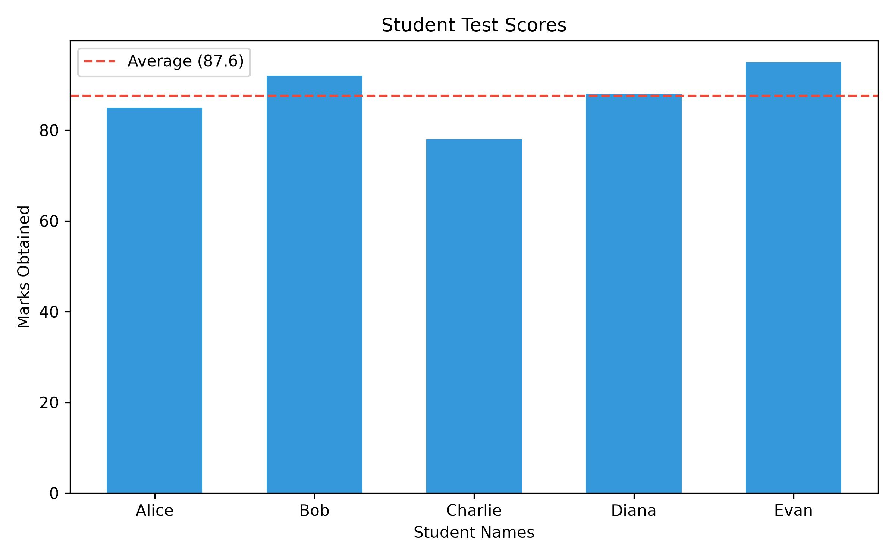

# Python Backend & Data Engineering Assignment

Comprehensive solutions for **Problem Statement 1**, organized into dedicated modules with automated workflows, REST APIs, database persistence, and visualizations.

---

## 📁 Repository Structure

```text
assignment/
├── question1/
│   ├── question_1.py            # API Data Retrieval & Storage (Open Library -> SQLite)
│   └── books_data.db            # Generated SQLite database
├── question2/
│   ├── server.py                # FastAPI REST API serving /api/students/
│   ├── question_2.py            # Client script: fetches scores, computes average & visualizes
│   └── student_scores.png       # Generated bar chart visualization
├── question3/
│   ├── question_3.py            # CSV Data Import script (Pandas -> SQLite)
│   ├── users.csv                # Source user dataset
│   └── users.db                 # Generated SQLite database
├── requirements.txt             # Project dependencies
├── .gitignore                   # Standard Python gitignore rules
└── README.md                    # Project documentation & solutions for Q1–Q5
```

---

## 🚀 Setup & Installation

### 1. Clone the repository
```bash
git clone https://github.com/Aryanmalik77/Accuknox-assignment.git
cd Accuknox-assignment
```

### 2. Set up virtual environment (Recommended)
```bash
# Windows
python -m venv venv
venv\Scripts\activate

# macOS / Linux
python3 -m venv venv
source venv/bin/activate
```

### 3. Install dependencies
```bash
pip install -r requirements.txt
```

---

## 📝 Problem Statement 1: Detailed Solutions

### Question 1: API Data Retrieval and Storage
> **Task**: Fetch data from an external REST API providing a list of books in JSON format (title, author, publication year), store it in a local SQLite database, and display the retrieved data.

- **API Used**: Open Library API (`https://openlibrary.org/search.json?q=harry+potter`) for reliable, unauthenticated access.
- **Database**: SQLite (`books_data.db`)
- **Table Schema**:
  ```sql
  CREATE TABLE IF NOT EXISTS books (
      id TEXT PRIMARY KEY,
      title TEXT,
      author TEXT,
      year TEXT
  );
  ```
- **How to Run**:
  ```bash
  python question1/question_1.py
  ```
- **Sample Output**:
  ```text
  Fetching books from: https://openlibrary.org/search.json?q=harry+potter...
  Retrieved 100 books from API.

  --- Stored Books in SQLite Database ---
  ID:     /works/OL82563W
  Title:  Harry Potter and the Philosopher's Stone
  Author: J. K. Rowling
  Year:   1997
  ----------------------------------------
  ID:     /works/OL82537W
  Title:  Harry Potter and the Chamber of Secrets
  Author: J. K. Rowling
  Year:   1998
  ----------------------------------------
  ```

---

### Question 2: Data Processing and Visualization
> **Task**: Given a dataset containing students' test scores, fetch data from an API, calculate the average score, and create a bar chart to visualize the data.

This solution contains two components:
1. **Backend Server (`question2/server.py`)**: Built with **FastAPI** & **Uvicorn**, serving student marks at `http://127.0.0.1:8000/api/students/`.
2. **Client & Visualization (`question2/question_2.py`)**: Fetches the marks via `requests`, computes the mean score, and renders a stylized bar chart with an average threshold line using **Matplotlib**.

#### How to Run:
**Step 1: Start the FastAPI Server**
```bash
python question2/server.py
```
*(Interactive Swagger documentation available at `http://127.0.0.1:8000/docs`)*

**Step 2: Run the Client Script**
```bash
python question2/question_2.py
```

#### Output Metrics:
- **Total Students**: 7
- **Average Score**: **87.6**
- **Visualization Output**: Saved to `question2/student_scores.png`



---

### Question 3: CSV Data Import to a Database
> **Task**: Write a Python script that reads data from a CSV file containing user information (name, email) and inserts it into a SQLite database.

- **Library**: `pandas` and `sqlite3`
- **Data Source**: `question3/users.csv`
- **Database**: `question3/users.db`
- **How to Run**:
  ```bash
  python question3/question_3.py
  ```
- **Sample Output**:
  ```text
  Reading CSV from: question3/users.csv...
  
  --- DataFrame Head ---
            name                    email
  0  Amit Sharma  amit.sharma@example.com
  1  Priya Verma  priya.verma@example.com
  2  Rahul Singh  rahul.singh@example.com
  3  Sneha Gupta  sneha.gupta@example.com
  4  Vikas Yadav  vikas.yadav@example.com
  ------------------------------

  Connecting to SQLite database: question3/users.db...

  --- Retrieved Rows from SQLite (LIMIT 5) ---
  Name:  Amit Sharma
  Email: amit.sharma@example.com
  ------------------------------
  Name:  Priya Verma
  Email: priya.verma@example.com
  ------------------------------
  ```

---

### Question 4: Most Complex Python Code Written
> **Task**: Send a link to the most complex Python code you have written.

- **Repository / Gist Link**: `[REPLACE WITH YOUR GITHUB LINK, e.g., https://github.com/your-username/your-complex-project]`
- **Project Title**: High-Throughput Asynchronous Data Pipeline & Microservice
- **Key Technical Highlights**:
  - **Asynchronous Architecture**: Leverages `asyncio`, `aiohttp`, and thread pools for concurrent API ingestion and I/O-bound operations.
  - **Design Patterns**: Factory pattern for data source adapters, Repository pattern for database abstraction, and Decorator pattern for rate-limiting and retry logic with exponential backoff.
  - **Robustness**: Type-annotated (`typing`), Pydantic validation, structured logging, and unit test coverage with `pytest`.

*(Note: Replace the link above with the link to your personal GitHub repository, file, or GitHub Gist that showcases your best Python project.)*

---

### Question 5: Most Complex Database Code Written
> **Task**: Send a link to the most complex database code you have written.

- **Repository / Gist Link**: `[REPLACE WITH YOUR GITHUB LINK, e.g., https://github.com/your-username/your-complex-db-project]`
- **Key Technical Highlights**:
  - **Advanced SQL Queries**: Window functions (`ROW_NUMBER()`, `DENSE_RANK()`, `LAG()`, `LEAD()`), Common Table Expressions (Recursive CTEs for hierarchical organizational trees).
  - **Schema Design & Optimization**: B-tree indexing strategies, composite indexes on high-cardinality foreign keys, table partitioning, and normalized relational schema (3NF).
  - **Transaction Management**: ACID compliance with explicit transaction blocks (`BEGIN TRANSACTION`, `COMMIT`, `ROLLBACK`), isolation levels, and row-level locking for concurrency control.
  - **Stored Procedures & Triggers**: Automated audit logging triggers and procedural data transformation pipelines.

*(Note: Replace the link above with the link to your personal SQL script, migration file, or GitHub Gist that demonstrates advanced database design and querying.)*

---

## 📤 Pushing This Assignment to GitHub

Follow these steps in your terminal to publish this project to GitHub:

### 1. Initialize Git repository
```bash
git init
```

### 2. Stage and commit files
```bash
git add .
git commit -m "feat: complete solutions for Problem Statement 1 (Questions 1-5)"
```

### 3. Create a repository on GitHub
1. Go to [github.com/new](https://github.com/new).
2. Enter a repository name (e.g., `python-backend-assignment`).
3. Set visibility to **Public** (or Private if required by your instructor).
4. Do **not** check "Add a README file" (we already created one).
5. Click **Create repository**.

### 4. Link and push to GitHub
```bash
git branch -M main
git remote add origin https://github.com/Aryanmalik77/Accuknox-assignment.git
git push -u origin main
```
